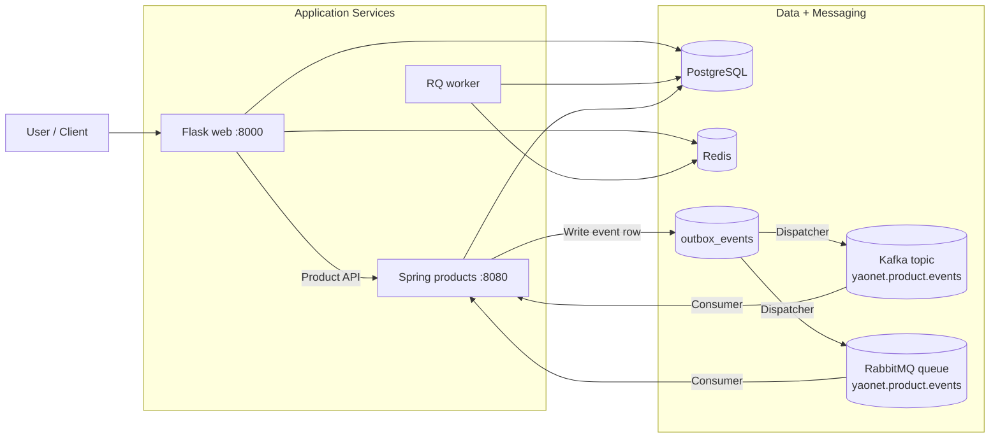

# Yaonet - Hybrid Flask + Spring Platform

[](https://www.python.org/)
[](https://flask.palletsprojects.com/)
[](https://spring.io/projects/spring-boot)
[](https://docs.docker.com/compose/)

Yaonet is a hybrid architecture project:

- Flask service for auth, social features, UI pages, API gateway behavior
- Spring Boot service for product catalog APIs
- Messaging pipeline using Outbox + Kafka + RabbitMQ
- Multiple deployment paths: Docker Compose, Kubernetes, Helm, Cloud Run, Ansible

## What Changed (Latest Architecture)

This repository has moved beyond a single-service "Microblog" layout.

Current core topology:

1. `web` (Flask + Gunicorn) on port `8000`
2. `products` (Spring Boot) on port `8080`
3. `db` (PostgreSQL)
4. `redis` (cache + RQ)
5. `kafka` (event stream)
6. `rabbitmq` (queue + DLQ)
7. `worker` (RQ background jobs)

Product write operations now follow an outbox-driven flow:

1. API write in `products`
2. Store event in `outbox_events`
3. Scheduled dispatcher publishes to Kafka and RabbitMQ
4. Built-in consumers process and log delivery status

## Architecture Diagram



## Repository Layout

```text
yaonet/
├── app/                          # Flask app (auth/main/api/articles/products)
├── yaonet.py                     # Flask entry point
├── yaonet-products/              # Spring Boot products service
├── migrations/                   # Flask Alembic migrations
├── docker-compose.yml            # Local multi-service stack
├── scripts/
│   ├── run_dev.sh
│   ├── run_prod.sh
│   ├── stop_dev.sh
│   └── smoke_test_messaging.sh   # One-click E2E smoke test
├── k8s/                          # Kubernetes manifests
├── helm/yaonet/                  # Helm chart
├── ansible/                      # Ansible deployment playbooks/roles
├── cloud-deployment/             # Cloud Run deployment assets
└── terraform/                    # Infra provisioning (GCP)
```

## Quick Start (Recommended)

### 1. Start local stack

```bash
docker compose up -d db redis web rabbitmq kafka products
```

### 2. Run one-click end-to-end smoke test

```bash
./scripts/smoke_test_messaging.sh
```

What this script verifies:

1. Service readiness
2. Flask token generation
3. Product creation via `POST /api/products`
4. Outbox row creation and `published_at` update
5. Kafka topic delivery
6. RabbitMQ consumer delivery

## Service Endpoints

When running with Docker Compose:

- Flask web: `http://localhost:8000`
- Flask health: `http://localhost:8000/health`
- Products API: `http://localhost:8080/api/products`
- RabbitMQ management: `http://localhost:15672` (guest/guest)
- Kafka broker: `localhost:9092`

## Messaging Configuration (Products Service)

Main environment variables used by `products`:

- `MESSAGING_ENABLED`
- `KAFKA_ENABLED`
- `KAFKA_BOOTSTRAP_SERVERS`
- `KAFKA_TOPIC_PRODUCT_EVENTS`
- `KAFKA_TOPIC_PRODUCT_EVENTS_DLT`
- `RABBITMQ_ENABLED`
- `RABBITMQ_HOST`
- `RABBITMQ_PRODUCT_EVENTS_QUEUE`
- `RABBITMQ_PRODUCT_EVENTS_DLX`
- `RABBITMQ_PRODUCT_EVENTS_DLQ`
- `OUTBOX_DISPATCH_INTERVAL_MS`

See detailed product service docs in [yaonet-products/README.md](yaonet-products/README.md).

## Development Notes

### Flask migrations

Standard workflow:

```bash
flask db migrate -m "your change"
flask db upgrade
```

### RQ worker

```bash
rq worker yaonet-tasks
```

### Local helper scripts

- [scripts/run_dev.sh](scripts/run_dev.sh)
- [scripts/run_prod.sh](scripts/run_prod.sh)
- [scripts/stop_dev.sh](scripts/stop_dev.sh)
- [scripts/smoke_test_messaging.sh](scripts/smoke_test_messaging.sh)

## Deployment Docs

- [YAONET_DEPLOYMENT_GUIDE.md](YAONET_DEPLOYMENT_GUIDE.md)
- [cloud-deployment/DEPLOYMENT_START_HERE.md](cloud-deployment/DEPLOYMENT_START_HERE.md)
- [k8s/GKE-QUICK-START.md](k8s/GKE-QUICK-START.md)
- [k8s/MINIKUBE-QUICK-START.md](k8s/MINIKUBE-QUICK-START.md)
- [helm/yaonet/README.md](helm/yaonet/README.md)
- [ansible/README.md](ansible/README.md)

## Additional Project Docs

- [aboutme.md](aboutme.md)
- [DEBUG_QUICKSTART.md](DEBUG_QUICKSTART.md)
- [MONITORING.md](MONITORING.md)
- [jenkins_docker/README.md](jenkins_docker/README.md)

## License

MIT License. See [LICENSE](LICENSE).

## Current Status

- Project name: **yaonet**
- Architecture: **hybrid Flask + Spring + Kafka/RabbitMQ (outbox)**
- Local E2E smoke test: **available via one command**
